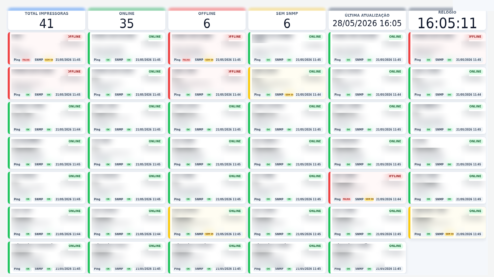
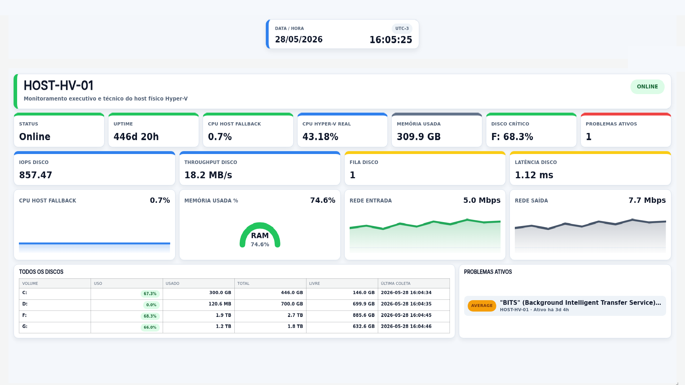
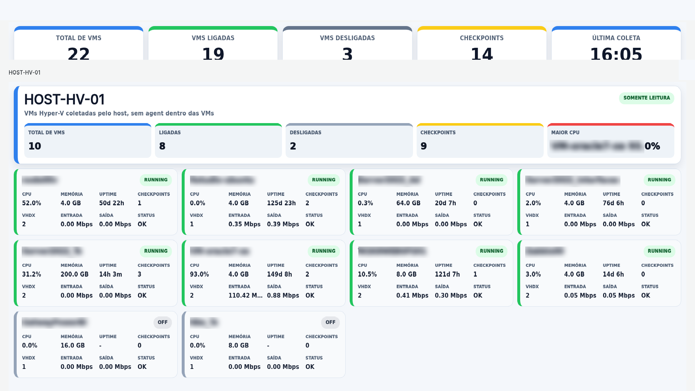
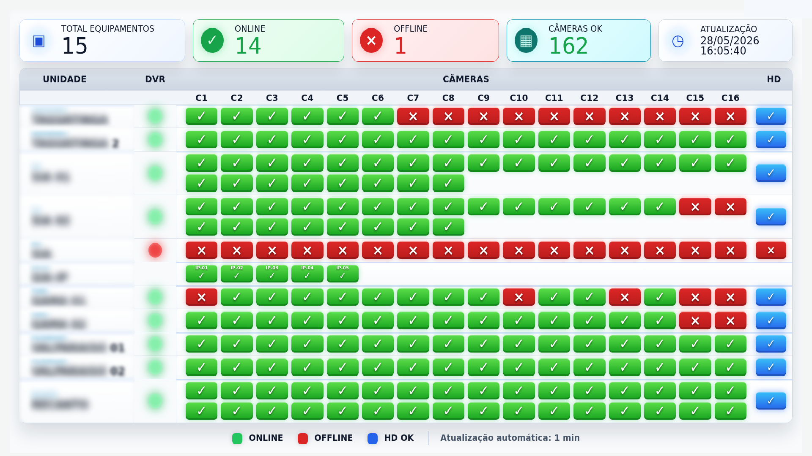

# Projetos de Monitoramento para Grafana e Zabbix

Pacote sanitizado para GitHub com dashboards, scripts de automacao e documentacao para quatro projetos oficiais:

- Monitoramento de Impressoras
- Hyper-V Hosts - Monitoramento Executivo V2
- Monitoramento DVR Intelbras
- Hyper-V VMs - Monitoramento Executivo

## Estrutura

```text
dashboards/   Dashboards Grafana exportados sem IDs internos fixos
scripts/      Scripts de descoberta, coleta, importacao e validacao
images/       Screenshots reais dos dashboards, capturados em Chromium desktop e sanitizados
docs/         Relatorio de sanitizacao e notas tecnicas
```

## Tecnologias

- Grafana
- Zabbix e plugin Zabbix datasource para Grafana
- Python 3
- Shell script
- Raspberry Pi em modo kiosk com Chromium
- SNMP, quando aplicavel aos dispositivos monitorados

## Screenshots






As imagens acima sao screenshots reais capturados em Chromium desktop, em modo kiosk/fullscreen, com dados sensiveis borrados ou substituidos por placeholders.

## Como usar

Leia `INSTALL.md`, copie `.env.example` para `.env` localmente e preencha os valores do seu ambiente. Nunca commite `.env`.
